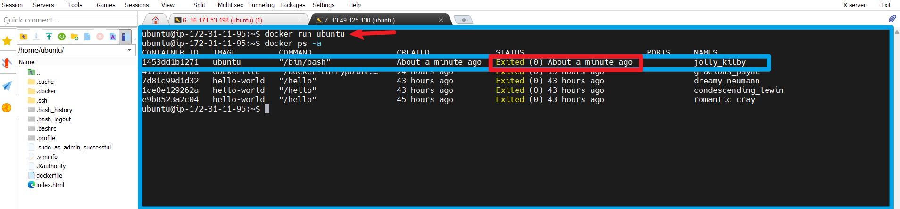

# Docker Containers
## Docker Containers For Beginners
### Introduction To Docker Containers

Docker containers are lightweight, portable, and efficient units of software that package up an application and all its dependencies, ensuring it runs reliably across different computing environments. Containers share the host operating system's kernel, making them more resource-efficient than traditional virtual machines.

### Running Containers

  To run a container,you use the `docker run` command followed by the name of the image you want to use.

  Lets create a container from the ubuntu image we pulled earlier from docker hub.

     docker run ubuntu
 This command launches a container based on the ubuntu image.

   

  The image above shows the container is created but not running.We can start the container by running

    docker start CONTAINER_ID

  **Launching Containers With Different Options**

  Docker provides various options to customize the behavior of containers. For example, you can specify environment variables,map ports and map volumes. Example of running a container with a specific environmental variable.

    docker run -e "MY_VARIABLE=my-value" ubuntu

  **Running Containers in the background**

  By default, containers run in the foreground, and the terminal is attached to the containers standard input/output.To run containers in the background, use the `d` option.

    docker run -d ubuntu

   This command starts a container in the background, allowing you to continue to use the terminal.

  **Container Lifecycle**

  Containers have a lifecycle that includes creating, starting,stopping, and restarting. Once a container is created. it can be started and stopped multiple times.

  **Starting, Stopping, and Restarting Containers**

  To start a stopped container

    docker start container_name

  To stop a running Container

    docker stop container_name

  To restart a Container

    docker restart container_name

  **Removing Containers**

  To remove a container,use the `docker rm` command followed by the container ID or name.

    docker rm container_name

  This deletes the container BUT as well remember that the image is still in place and the container can be recreated using the image again.

